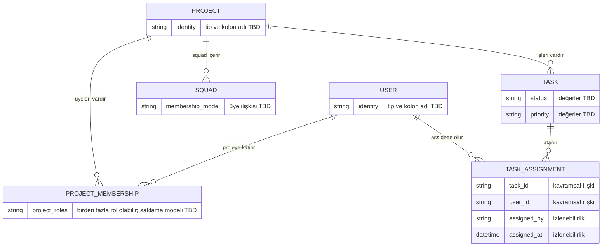

# Kavramsal ER diyagramı

> Bu çizim teknik plandaki V1 kavramlarını gösterir; uygulanmış SQL şeması değildir. `id` tipleri, fiziksel tablo/kolon adları ve aşağıda belirtilmeyen kardinaliteler feature planları ve Flyway migration'larıyla kesinleşecektir.

`TaskAssignment` için `(task_id, user_id)` benzersizdir. Bir task'ın bir veya çok assignee'si olabilir; V1'de sabit üst limit yoktur. Atanan kullanıcı task'ın projesinin üyesi olmalıdır. Bu son kural application/service katmanında doğrulanır.

## Diğer V1 kavramları

| Kavram | Planın belirlediği amaç | Açık kalan ilişki |
| --- | --- | --- |
| `Issue` | Proje/task problemi veya blocker takibi | Projeye ve/veya task'a bağlama biçimi |
| `TestReport` | Tamamlanan iş için tester geri bildirimi | Task/tester bağları ve sonuç şeması |
| `Comment` | İlgili iş öğelerinde tartışma/not | Hedef öğe modeli |
| `Notification` | Kalıcı uygulama içi bildirim ve okunma durumu | Üretici event, alıcı ve fiziksel şema |
| `Squad` | Proje içi grup ve üye yönetimi | Üyelik tablosu/kardinalite |
| `ProjectMembership` | Kullanıcı ve projeyi proje rolleriyle bağlama | Çoklu rolün fiziksel saklama modeli |

Bu ilişkiler netleşmeden foreign key veya polymorphic ilişki tasarımı sabitlenmemelidir. Fiziksel şema için [database.md](database.md) ve ilgili Flyway migration'ları esas alınır.
