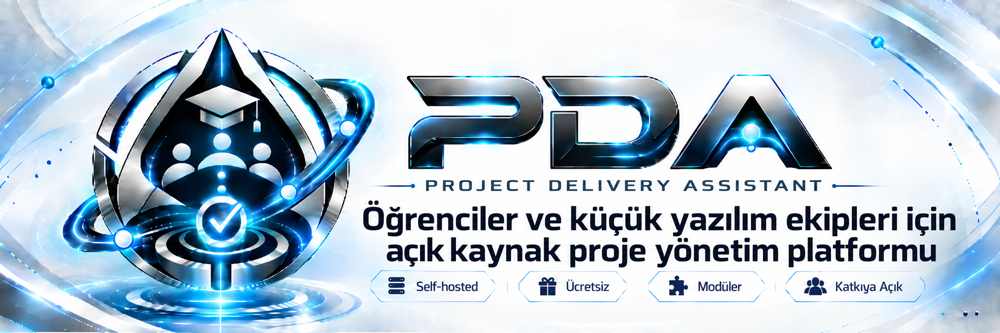
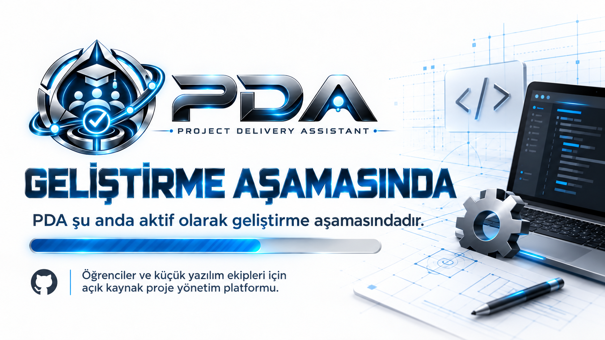

<p align="center">
  <strong>🇹🇷 Türkçe</strong> ·
  <a href="README_EN.md">🇬🇧 English</a>
</p>

<p align="center">
  
</p>

<p align="center">
  <a href="LICENSE"></a>
  
  
  
</p>

<p align="center">
  
  
  
  
</p>

# PDA — Project Delivery Assistant

**PDA**, öğrenciler ve küçük yazılım ekipleri için geliştirilen **ücretsiz, açık kaynak ve self-hosted proje yönetim platformudur**.

Amaç; Jira veya Plane gibi araçlarda bulunan temel proje ve görev yönetimi deneyimini, öğrencilerin ve küçük ekiplerin kolayca kurabileceği, anlayabileceği ve geliştirmeye katkı verebileceği daha sade bir yapıda sunmaktır.

PDA yalnızca bir görev listesi değildir. Proje oluşturma, ekip ve rol yönetimi, görev atama, test raporları, bildirimler ve ekip içi iş akışlarını tek bir platformda toplamayı hedefler.

> [!IMPORTANT]
> PDA şu anda aktif geliştirme aşamasındadır. V1 teknik planı tamamlandı; repository, backend ve frontend temelleri adım adım oluşturuluyor.

<p align="center">
  
</p>

---

## 🎯 Neden PDA?

PDA'nın ilk hedef kitlesi **öğrenciler ve küçük yazılım ekipleri**. Özellikle üniversite projelerinde veya küçük ekip çalışmalarında şu sorunları azaltmayı hedefliyoruz:

- görevlerin WhatsApp / Discord mesajları arasında kaybolması,
- kimin hangi işten sorumlu olduğunun belirsizleşmesi,
- proje ilerleyişinin takip edilememesi,
- test ve hata süreçlerinin dağınık yürütülmesi,
- ücretli proje yönetim araçlarının küçük ekipler için gereksiz karmaşık veya maliyetli olması.

PDA bu süreci **tek yerde, açık kaynak ve kurulabilir** hale getirmeyi amaçlar.

### Temel prensipler

- **Açık kaynak:** Apache License 2.0
- **Ücretsiz kullanım hedefi:** mümkün olduğunca ücretsiz servislerle çalışabilme
- **Self-hosted:** kendi altyapınızda çalıştırabilme
- **Öğrenci odaklı:** gerçek yazılım ekiplerindeki rol ve görev akışlarını deneyimleme
- **Modüler ama sade:** Microservice yerine Modular Monolith
- **Katkıya açık:** Issue, feature request ve pull request desteği
- **Güvenli varsayılanlar:** secret yönetimi, cookie tabanlı auth, validation ve RBAC

---

## ✨ V1 Kapsamı

V1 için hedeflenen ana yetenekler:

- kullanıcı kayıt / giriş / çıkış akışı,
- access + refresh token yapısı,
- HttpOnly cookie tabanlı authentication,
- BCrypt ile şifre saklama,
- `.env` üzerinden ilk admin bootstrap,
- proje oluşturma ve proje üyelerini yönetme,
- proje bazlı roller,
- bir göreve tek veya birden fazla kullanıcı atama,
- görev tarihleri, durumları ve tamamlanma akışları,
- Squad / ekip yönetimi,
- Issue / problem kayıtları,
- Tester rolü için test raporları,
- uygulama içi kalıcı bildirimler,
- SMTP veya Brevo üzerinden opsiyonel e-posta desteği,
- Türkçe / İngilizce arayüz,
- Light / Dark / System tema desteği,
- mobil, tablet, laptop ve masaüstü responsive tasarım,
- Swagger / OpenAPI dokümantasyonu,
- Docker tabanlı geliştirme ortamı.

> Detaylı servis methodları, endpoint davranışları ve lifecycle kuralları ilgili feature geliştirilmeden hemen önce planlanacaktır.

---

## 🧭 Yol Haritası

README aynı zamanda projenin yüksek seviyeli ilerleme durumunu gösterecek şekilde tutulacaktır.

| Aşama | Durum |
|---|---|
| Teknik planlama | ✅ Tamamlandı |
| Marka / README / açık kaynak repo temeli | 🟡 Devam ediyor |
| Backend scaffold | ⏳ Sırada |
| Authentication & Security | ⏳ Planlandı |
| Project / Role / Squad modülleri | ⏳ Planlandı |
| Task management | ⏳ Planlandı |
| Notification / Mail | ⏳ Planlandı |
| Frontend scaffold | ⏳ Planlandı |
| UI / UX geliştirme | ⏳ Planlandı |
| Frontend ↔ Backend entegrasyonu | ⏳ Planlandı |
| Regression / E2E / Performance testleri | ⏳ Planlandı |
| Deployment kararı | ⏳ TBD |
| V1.0.0 | ⏳ Hedef |

---

## 🧩 Rol Yapısı

PDA'da V1 rollerinin yetkileri uygulama tarafında sabit tutulur. Bir kullanıcı aynı projede birden fazla role sahip olabilir.

### Global rol

- `ADMIN`

### Proje bazlı roller

- `PROJECT_MANAGER`
- `BACKEND_ENGINEER`
- `FRONTEND_ENGINEER`
- `FULL_STACK_DEVELOPER`
- `TESTER`
- `UI_DESIGNER`

Aynı kullanıcı farklı projelerde farklı rollere sahip olabilir.

---

## 🏗️ Mimari ve Teknoloji Yığını

PDA, **Modular Monolith** mimarisi ile geliştirilmektedir.

Bu yaklaşım ile:

- modüller birbirinden net biçimde ayrılır,
- tek backend deployment korunur,
- microservice operasyon yükü oluşmaz,
- ücretsiz / düşük maliyetli deployment hedefi desteklenir,
- ileride ihtiyaç oluşursa modüllerin ayrıştırılması kolaylaşır.

<p align="center">
  
</p>

### Frontend

- Next.js
- TypeScript
- Tailwind CSS
- shadcn/ui — seçici / opsiyonel kullanım
- App Router
- Feature-based architecture

### Backend

- Java
- Spring Boot
- Maven
- Spring Security
- Spring Data JPA / Hibernate
- Flyway
- Spring Modulith
- MapStruct
- Lombok
- Spring Boot Actuator
- Springdoc OpenAPI / Swagger

### Veri Katmanı

- PostgreSQL
- Development: Docker içindeki PostgreSQL
- Production database için öncelikli ücretsiz seçenek: Neon

### Altyapı

- Docker
- Docker Compose
- `.env` tabanlı config yönetimi

> Production deployment platformu bilinçli olarak **TBD** bırakılmıştır ve daha sonra ayrıca kararlaştırılacaktır.

---

## 🔐 Güvenlik Yaklaşımı

PDA deploy edilebilir açık kaynak bir proje olduğu için güvenlik varsayılanları baştan sıkı tutulacaktır.

- Şifreler **BCrypt** ile hashlenir.
- Access ve refresh tokenlar **HttpOnly cookie** içerisinde tutulur.
- `localStorage` ve `sessionStorage` içerisinde auth token tutulmaz.
- Cookie tabanlı auth nedeniyle CSRF koruması aktif tutulur.
- Production CORS explicit allowlist ile yönetilir.
- Spring Data JPA ve parameterized query kullanımı tercih edilir.
- Dynamic SQL string concatenation yasaktır.
- Backend input validation zorunludur.
- Auth endpointlerinde rate limiting / brute-force koruması uygulanır.
- Secret değerler yalnızca ENV / deployment secret store üzerinden alınır.
- Password, JWT, cookie içeriği ve secret bilgiler loglanmaz.
- Swagger production'da varsayılan olarak kapalıdır.

---

## 📚 API Standardı

REST API şu versioning standardı ile başlayacaktır:

```text
/api/v1/...
```

Yeni API versiyonu yalnızca **breaking change** olduğunda açılır.

Development:

```env
API_DOCS_ENABLED=true
```

Production varsayılanı:

```env
API_DOCS_ENABLED=false
```

---

## 📬 E-posta ve Bildirimler

Mail altyapısı provider bağımsız tutulacaktır.

Desteklenen transport seçenekleri:

- standart SMTP,
- Brevo HTTP API.

Örnek:

```env
MAIL_ENABLED=true
MAIL_PROVIDER=smtp
```

veya:

```env
MAIL_PROVIDER=brevo
```

Mail kapalı olsa bile PDA çalışmaya devam eder.

In-app notification sistemi mailden bağımsızdır ve V1'de:

- persistent notification,
- read / unread state,
- unread count

destekler.

---

## 🎨 Frontend Standartları

Arayüz tasarımı en baştan **mobil, tablet, laptop ve masaüstü** için hazırlanacaktır.

- Light / Dark / System
- Türkçe + İngilizce
- ileride yeni dil eklemeye uygun i18n altyapısı
- breadcrumb
- toast sistemi
- inline validation mesajları
- confirmation dialog
- skeleton / loading state
- empty state
- error state
- özel `403`, `404`, `500` sayfaları
- global notification center
- accessibility kuralları
- favicon / app icon seti
- Next.js Metadata API
- Open Graph / social share preview
- Web App Manifest
- proje assetlerinde WebP / AVIF optimizasyonu

---

## 🧪 Test Stratejisi

### Backend geliştirmesi sırasında

- JUnit Jupiter
- Mockito
- AssertJ
- Spring Boot Test
- MockMvc
- Spring Security Test
- Spring Modulith architecture testleri
- Testcontainers + PostgreSQL
- Regression testleri
- JaCoCo coverage

### Frontend geliştirmesi sırasında

- kritik kullanıcı akışları
- routing / role kontrolleri
- form ve validation senaryoları
- Playwright E2E
- Chromium / Firefox / WebKit kontrolleri

### Pull Request / CI sırasında

- backend automated test suite
- frontend build / lint / type-check
- JaCoCo coverage
- SonarQube Cloud analizi
- Docker build validation

### Release öncesi

- full regression
- kritik E2E senaryoları
- browser compatibility
- Grafana k6 load / stress testleri
- Sonar Quality Gate

> Hedef `%100 coverage` değildir. Kritik business logic, security ve regression senaryolarını güvence altına almak önceliklidir.

---

## 🚀 Hızlı Başlangıç

> [!NOTE]
> Repository henüz aktif scaffold aşamasındadır. Aşağıdaki akış backend ve frontend temelleri tamamlandığında projenin ana kurulum yöntemi olacaktır.

### Gereksinimler

- Git
- Docker Desktop **veya** Docker Engine + Docker Compose

Java, Node.js ve PostgreSQL'i host makineye ayrı ayrı kurmak ana Docker akışı için zorunlu olmayacaktır.

### 1. Repoyu klonlayın

```bash
git clone https://github.com/alperrte/project-delivery-assistant.git
cd project-delivery-assistant
```

### 2. Environment dosyasını oluşturun

Linux / macOS:

```bash
cp .env.example .env
```

Windows PowerShell:

```powershell
Copy-Item .env.example .env
```

### 3. `.env` değerlerini doldurun

```env
# Application
APP_ENV=development

# Database
DB_URL=
DB_USERNAME=
DB_PASSWORD=

# JWT
JWT_SECRET=
JWT_ACCESS_TOKEN_EXPIRATION=15m
JWT_REFRESH_TOKEN_EXPIRATION=7d

# API Documentation
API_DOCS_ENABLED=true

# Mail
MAIL_ENABLED=false
MAIL_PROVIDER=smtp
SMTP_HOST=
SMTP_PORT=587
SMTP_USERNAME=
SMTP_PASSWORD=
SMTP_FROM_ADDRESS=
BREVO_API_KEY=

# Frontend / CORS
FRONTEND_URL=
ALLOWED_ORIGINS=

# Initial Admin
ADMIN_EMAIL=
ADMIN_INITIAL_PASSWORD=
```

> Gerçek `.env` dosyası hiçbir zaman Git'e commit edilmemelidir.

### 4. Servisleri başlatın

```bash
docker compose up --build
```

Development ortamında hedef servisler:

```text
Frontend
Backend
PostgreSQL
```

### 5. Servisleri durdurun

```bash
docker compose down
```

---

## 🗃️ Migration Yönetimi

Database migration işlemleri **Flyway** ile versioned olarak ilerler:

```text
V1__initial_schema.sql
V2__create_projects.sql
V3__create_tasks.sql
V4__add_notifications.sql
...
```

Schema değişiklikleri production'da manuel SQL yerine migration dosyaları üzerinden yürütülecektir.

---

## ⚙️ Environment ve Config Yönetimi

Spring profilleri:

```text
application.yml
application-dev.yml
application-test.yml
application-prod.yml
```

Secret yönetimi:

```text
.env              ❌ Git
.env.local        ❌ Git
.env.example      ✅ Git
```

Production ortamında zorunlu secret eksikse uygulama **fail-fast** davranacaktır.

---

## 👑 İlk Admin Hesabı

İlk admin hesabı `.env` üzerinden bootstrap edilir:

```env
ADMIN_EMAIL=
ADMIN_INITIAL_PASSWORD=
```

Akış:

1. sistem admin hesabı olup olmadığını kontrol eder,
2. yoksa ENV bilgileriyle oluşturur,
3. şifre yalnızca BCrypt hash olarak saklanır,
4. ilk girişte şifre değiştirme zorunlu tutulur,
5. restart sırasında mevcut admin ENV ile overwrite edilmez.

---

## 📈 Performans ve Gözlemlenebilirlik

V1'de ücretsiz ve sade deployment hedefi nedeniyle gereksiz altyapı eklenmeyecektir.

### V1

- Redis yok
- harici cache yok
- pagination
- ihtiyaca göre database indexleri
- uygun yerlerde Next.js cache
- Spring Boot / Logback console logs
- Spring Boot Actuator
- `/actuator/health`
- liveness / readiness
- Docker health check

### İhtiyaç çıkarsa daha sonra

- Spring Cache / Caffeine
- Redis
- Prometheus
- Grafana
- ELK
- Loki

Prensip: **önce ölç, sonra optimize et.**

---

## 🤝 Katkıda Bulunma

PDA açık kaynak ve katkıya açık bir projedir.

Katkı akışı:

1. repository'yi fork edin,
2. yeni bir branch oluşturun,
3. değişikliğinizi geliştirin,
4. ilgili testleri çalıştırın,
5. Pull Request açın.

Detaylar için [`CONTRIBUTING.md`](CONTRIBUTING.md) dosyasını inceleyebilirsiniz.

- Bug bildirmek için GitHub Issue şablonlarını kullanın.
- Yeni fikirler için Feature Request açın.
- Güvenlik açıklarını public issue yerine [`SECURITY.md`](SECURITY.md) sürecine göre bildirin.

---

## 📄 Lisans

PDA, **Apache License 2.0** altında lisanslanmaktadır.

Detaylar: [`LICENSE`](LICENSE)

---

## 👨‍💻 Geliştiriciler

<table>
  <tr>
    <td align="center">
      <strong>Alper Temiz</strong><br />
      <a href="https://github.com/alperrte">@alperrte</a>
    </td>
    <td align="center">
      <strong>Hamza Taşbay</strong><br />
      <a href="https://github.com/HmzT270">@HmzT270</a>
    </td>
  </tr>
</table>

---

<p align="center">
  
</p>

<p align="center">
  <strong>Öğrenciler ve küçük yazılım ekipleri için açık kaynak proje yönetimi.</strong>
</p>
