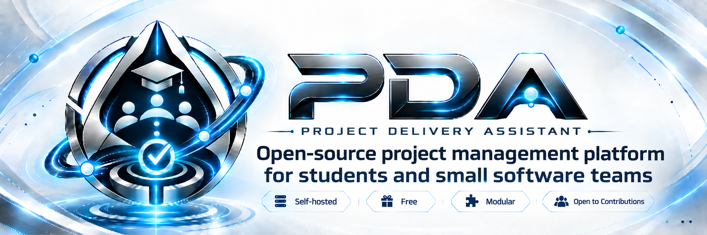
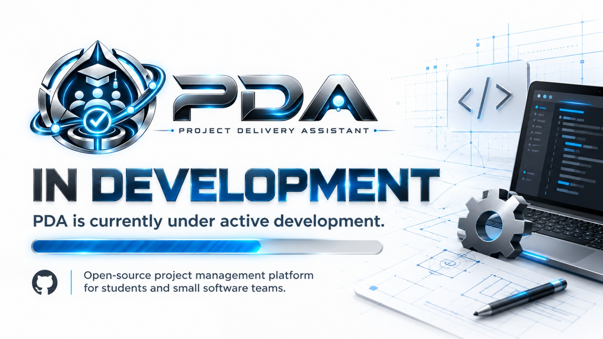
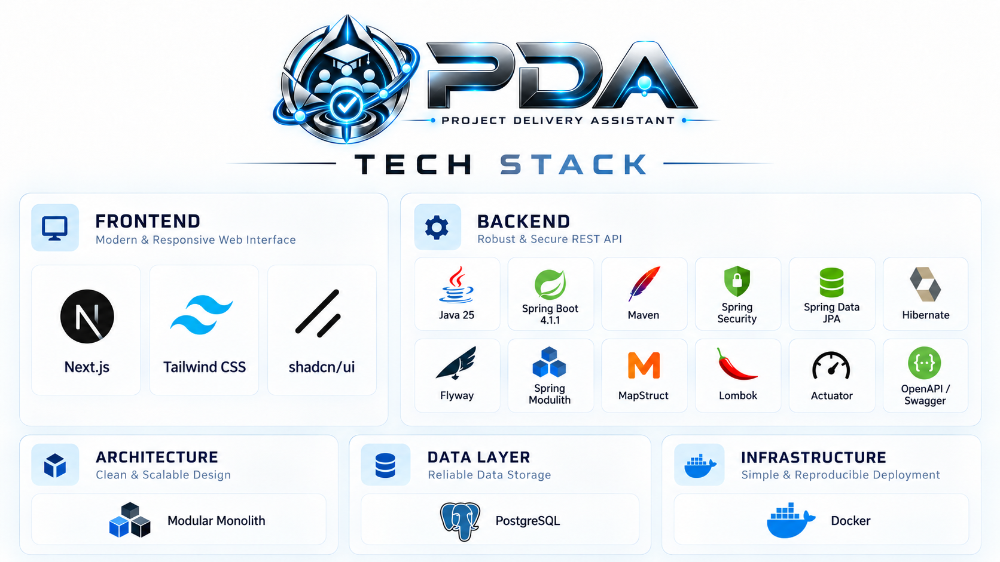
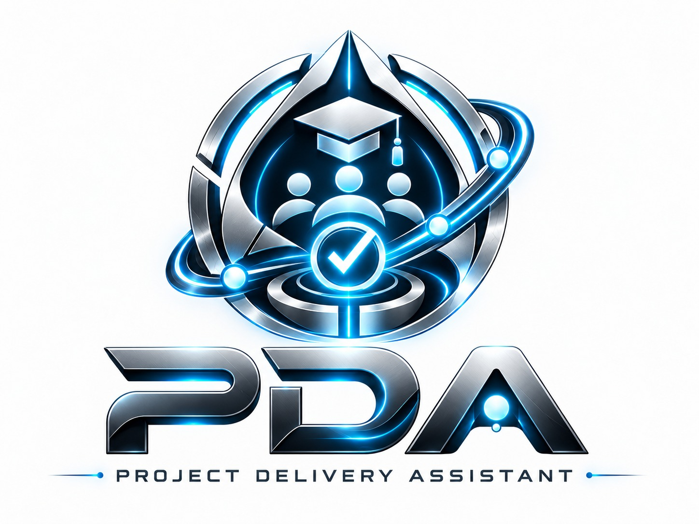

<p align="center">
  <a href="README.md">🇹🇷 Türkçe</a> ·
  <strong>🇬🇧 English</strong>
</p>

<p align="center">
  
</p>

<p align="center">
  <a href="LICENSE"></a>
  
  
  
</p>

<p align="center">
  
  
  
  
</p>

# PDA — Project Delivery Assistant

**PDA** is a **free, open-source and self-hostable project management platform** built for students and small software teams.

The goal is to provide the essential project and task management experience of tools such as Jira or Plane in a simpler form that students and small teams can understand, deploy and contribute to.

PDA is not just a task list. It aims to bring project creation, team and role management, task assignment, test reports, notifications and delivery workflows together in one platform.

> [!IMPORTANT]
> PDA is currently under active development. The V1 technical plan is complete, and the repository, backend and frontend foundations are being built step by step.

<p align="center">
  
</p>

---

## 🎯 Why PDA?

PDA's first target audience is **students and small software teams**. It aims to reduce common problems in university projects and small-team development such as:

- tasks getting lost in WhatsApp / Discord messages,
- unclear ownership of work,
- difficulty following project progress,
- fragmented testing and issue workflows,
- project management tools being too complex or expensive for small teams.

PDA aims to make this process **centralized, open-source and self-hostable**.

### Core principles

- **Open source:** Apache License 2.0
- **Free-first:** designed to work with free services where possible
- **Self-hosted:** run it on your own infrastructure
- **Student focused:** experience real software team roles and workflows
- **Modular but simple:** Modular Monolith instead of microservice overhead
- **Open to contributions:** issues, feature requests and pull requests
- **Secure defaults:** secret management, cookie-based auth, validation and RBAC

---

## ✨ V1 Scope

The V1 target includes:

- user signup / login / logout,
- access + refresh tokens,
- HttpOnly cookie based authentication,
- BCrypt password hashing,
- first-admin bootstrap through `.env`,
- project creation and project member management,
- project-scoped roles,
- single or multiple assignees per task,
- task dates, statuses and completion flows,
- Squad / team management,
- Issue / problem tracking,
- test reports for the Tester role,
- persistent in-app notifications,
- optional email through SMTP or Brevo,
- Turkish / English interface,
- Light / Dark / System themes,
- responsive mobile, tablet, laptop and desktop design,
- Swagger / OpenAPI documentation,
- Docker-based development workflow.

> Detailed service methods, endpoint behavior and lifecycle rules will be finalized immediately before implementing the related feature.

---

## 🧭 Roadmap

The README will also act as a high-level project progress view.

| Stage | Status |
|---|---|
| Technical planning | ✅ Complete |
| Brand / README / open-source repository foundation | ✅ Complete |
| Backend scaffold | ⏳ Next |
| Authentication & Security | ⏳ Planned |
| Project / Role / Squad modules | ⏳ Planned |
| Task management | ⏳ Planned |
| Notification / Mail | ⏳ Planned |
| Frontend scaffold | ⏳ Planned |
| UI / UX implementation | ⏳ Planned |
| Frontend ↔ Backend integration | ⏳ Planned |
| Regression / E2E / Performance testing | ⏳ Planned |
| Deployment decision | ⏳ TBD |
| V1.0.0 | ⏳ Target |

---

## 🧩 Role Model

V1 uses fixed role capabilities. A user may hold multiple roles within the same project.

### Global role

- `ADMIN`

### Project-scoped roles

- `PROJECT_MANAGER`
- `BACKEND_ENGINEER`
- `FRONTEND_ENGINEER`
- `FULL_STACK_DEVELOPER`
- `TESTER`
- `UI_DESIGNER`

The same user may hold different roles in different projects.

---

## 🏗️ Architecture & Tech Stack

PDA is being developed as a **Modular Monolith**.

This approach keeps:

- clear module boundaries,
- a single backend deployment,
- microservice operational overhead out of V1,
- free / low-cost deployment more realistic,
- future module extraction possible if it ever becomes necessary.

<p align="center">
  
</p>

### Frontend

- Next.js
- TypeScript
- Tailwind CSS
- shadcn/ui — optional / selective usage
- App Router
- Feature-based architecture

### Backend

- Java
- Spring Boot
- Maven
- Spring Security
- Spring Data JPA / Hibernate
- Flyway
- Spring Modulith
- MapStruct
- Lombok
- Spring Boot Actuator
- Springdoc OpenAPI / Swagger

### Data Layer

- PostgreSQL
- Development: PostgreSQL inside Docker
- Preferred free production database option: Neon

### Infrastructure

- Docker
- Docker Compose
- `.env` based configuration

> The production deployment platform is intentionally marked **TBD** and will be decided later.

---

## 🔐 Security Approach

PDA is designed to be deployable by anyone, so secure defaults are a core requirement.

- Passwords are hashed with **BCrypt**.
- Access and refresh tokens are stored in **HttpOnly cookies**.
- Auth tokens are never stored in `localStorage` or `sessionStorage`.
- CSRF protection remains enabled for cookie-based authentication.
- Production CORS uses an explicit allowlist.
- Spring Data JPA and parameterized queries are preferred.
- Dynamic SQL string concatenation is prohibited.
- Backend input validation is mandatory.
- Sensitive auth endpoints use rate limiting / brute-force protection.
- Secrets are provided only through ENV / deployment secret stores.
- Passwords, JWTs, cookie contents and secrets are never logged.
- Swagger is disabled by default in production.

---

## 📚 API Standard

The REST API starts with:

```text
/api/v1/...
```

A new API version is introduced only for a **breaking change**.

Development:

```env
API_DOCS_ENABLED=true
```

Production default:

```env
API_DOCS_ENABLED=false
```

---

## 📬 Email & Notifications

The mail layer is provider-independent.

Supported transports:

- standard SMTP,
- Brevo HTTP API.

Example:

```env
MAIL_ENABLED=true
MAIL_PROVIDER=smtp
```

or:

```env
MAIL_PROVIDER=brevo
```

PDA continues to work when mail is disabled.

The in-app notification system is independent from email and V1 supports:

- persistent notifications,
- read / unread state,
- unread count.

---

## 🎨 Frontend Standards

The UI is planned from the beginning for **mobile, tablet, laptop and desktop**.

- Light / Dark / System
- Turkish + English
- i18n structure ready for additional languages
- breadcrumbs
- toast system
- inline validation feedback
- confirmation dialogs
- skeleton / loading states
- empty states
- error states
- custom `403`, `404`, `500` pages
- global notification center
- accessibility rules
- favicon / app icon set
- Next.js Metadata API
- Open Graph / social share previews
- Web App Manifest
- WebP / AVIF optimization for project-owned assets

---

## 🧪 Testing Strategy

### During backend development

- JUnit Jupiter
- Mockito
- AssertJ
- Spring Boot Test
- MockMvc
- Spring Security Test
- Spring Modulith architecture tests
- Testcontainers + PostgreSQL
- Regression tests
- JaCoCo coverage

### During frontend development

- critical user flows
- routing / role checks
- form and validation scenarios
- Playwright E2E
- Chromium / Firefox / WebKit checks

### Pull Request / CI

- backend automated test suite
- frontend build / lint / type-check
- JaCoCo coverage
- SonarQube Cloud analysis
- Docker build validation

### Before a release

- full regression
- critical E2E scenarios
- browser compatibility
- Grafana k6 load / stress testing
- Sonar Quality Gate

> The goal is not `%100 coverage`. Protecting critical business logic, security and regression scenarios matters more than chasing a number.

---

## 🚀 Quick Start

> [!NOTE]
> The repository is still in the active scaffold phase. The flow below will become the primary setup path once the backend and frontend foundations are complete.

### Requirements

- Git
- Docker Desktop **or** Docker Engine + Docker Compose

Installing Java, Node.js and PostgreSQL separately on the host machine will not be required for the main Docker workflow.

### 1. Clone the repository

```bash
git clone https://github.com/alperrte/project-delivery-assistant.git
cd project-delivery-assistant
```

### 2. Create the environment file

Linux / macOS:

```bash
cp .env.example .env
```

Windows PowerShell:

```powershell
Copy-Item .env.example .env
```

### 3. Fill `.env`

```env
# Application
APP_ENV=development

# Database
DB_URL=
DB_USERNAME=
DB_PASSWORD=

# JWT
JWT_SECRET=
JWT_ACCESS_TOKEN_EXPIRATION=15m
JWT_REFRESH_TOKEN_EXPIRATION=7d

# API Documentation
API_DOCS_ENABLED=true

# Mail
MAIL_ENABLED=false
MAIL_PROVIDER=smtp
SMTP_HOST=
SMTP_PORT=587
SMTP_USERNAME=
SMTP_PASSWORD=
SMTP_FROM_ADDRESS=
BREVO_API_KEY=

# Frontend / CORS
FRONTEND_URL=
ALLOWED_ORIGINS=

# Initial Admin
ADMIN_EMAIL=
ADMIN_INITIAL_PASSWORD=
```

> The real `.env` file must never be committed to Git.

### 4. Start services

```bash
docker compose up --build
```

Target development services:

```text
Frontend
Backend
PostgreSQL
```

### 5. Stop services

```bash
docker compose down
```

---

## 🗃️ Migration Management

Database migrations are versioned with **Flyway**:

```text
V1__initial_schema.sql
V2__create_projects.sql
V3__create_tasks.sql
V4__add_notifications.sql
...
```

Production schema changes will be delivered through migration files instead of manual SQL changes.

---

## ⚙️ Environment & Configuration

Spring profiles:

```text
application.yml
application-dev.yml
application-test.yml
application-prod.yml
```

Secret management:

```text
.env              ❌ Git
.env.local        ❌ Git
.env.example      ✅ Git
```

Production will **fail fast** when required secrets are missing.

---

## 👑 Initial Admin Account

The first admin account is bootstrapped from `.env`:

```env
ADMIN_EMAIL=
ADMIN_INITIAL_PASSWORD=
```

Flow:

1. check whether an admin already exists,
2. create one from ENV if needed,
3. store the password only as a BCrypt hash,
4. require a password change on first login,
5. never overwrite an existing admin from ENV on restart.

---

## 📈 Performance & Observability

V1 avoids unnecessary infrastructure to preserve the free and simple deployment goal.

### V1

- no Redis
- no external cache service
- pagination
- database indexes based on real needs
- Next.js caching only where appropriate
- Spring Boot / Logback console logs
- Spring Boot Actuator
- `/actuator/health`
- liveness / readiness
- Docker health checks

### Revisit only if needed later

- Spring Cache / Caffeine
- Redis
- Prometheus
- Grafana
- ELK
- Loki

Principle: **measure first, optimize second.**

---

## 🤝 Contributing

PDA is open source and open to community contributions.

Contribution flow:

1. fork the repository,
2. create a new branch,
3. implement your change,
4. run the relevant tests,
5. open a Pull Request.

See [`CONTRIBUTING.md`](CONTRIBUTING.md) for details.

- Use GitHub Issue templates for bugs.
- Use Feature Requests for new ideas.
- Report security vulnerabilities through the process in [`SECURITY.md`](SECURITY.md), not as public issues.

---

## 📄 License

PDA is licensed under the **Apache License 2.0**.

Details: [`LICENSE`](LICENSE)

---

## 👨‍💻 Developers

<table>
  <tr>
    <td align="center">
      <strong>Alper Temiz</strong><br />
      <a href="https://github.com/alperrte">@alperrte</a>
    </td>
    <td align="center">
      <strong>Hamza Taşbay</strong><br />
      <a href="https://github.com/HmzT270">@HmzT270</a>
    </td>
  </tr>
</table>

---

<p align="center">
  
</p>

<p align="center">
  <strong>Open-source project management for students and small software teams.</strong>
</p>
